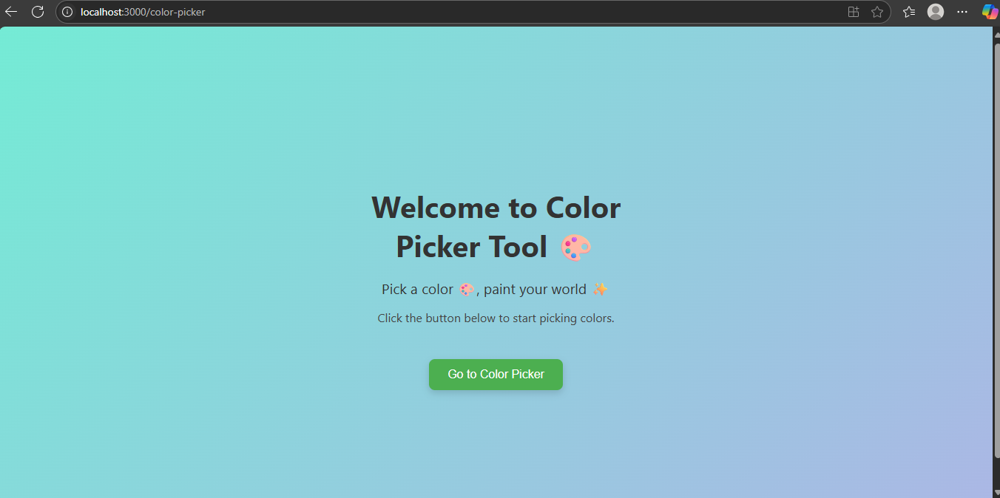
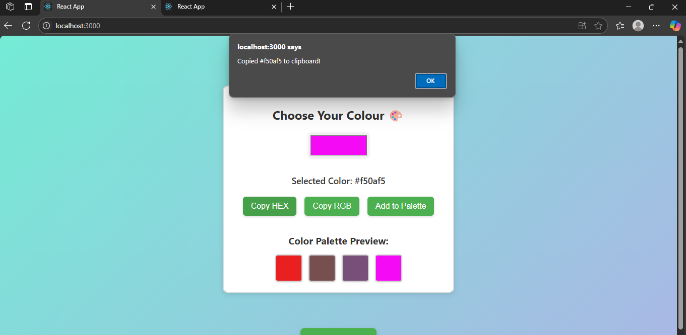
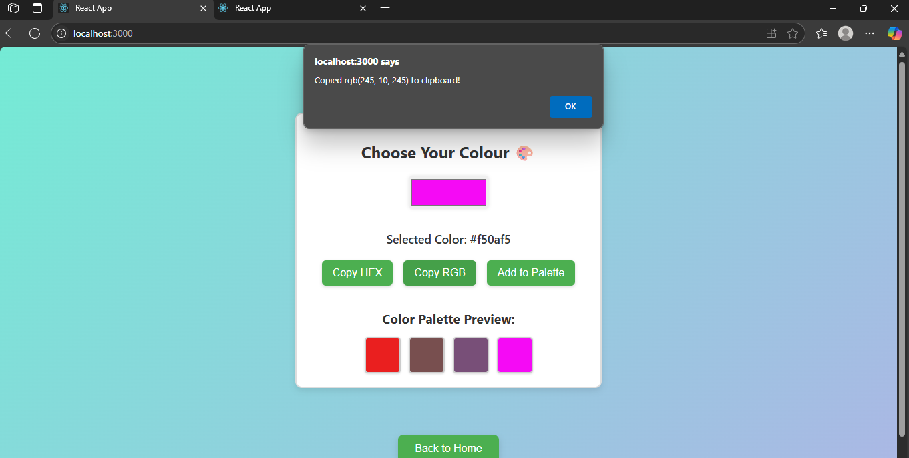
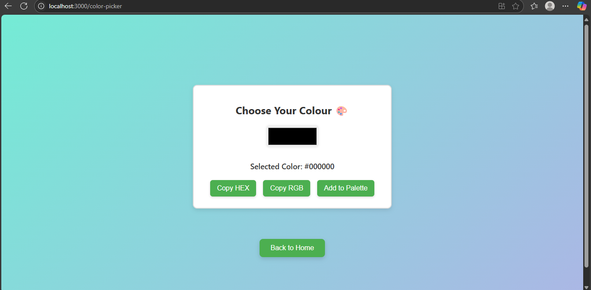
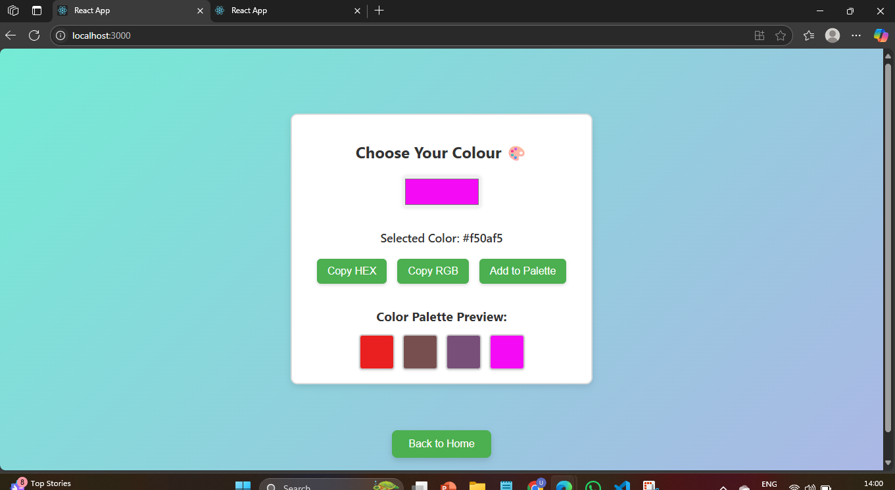

# Color Picker Tool 🎨
Title:Color Picker Tool
DESCRIPTION:
A React-based color picker app that allows users to select colors, view their HEX and RGB values, copy them, and save colors to a palette.

## Tech Stack Used

- React.js
- CSS
-Github for version control

## Key Features

- Select colors with a color input
- Display HEX and RGB codes of the selected color
- Copy HEX or RGB color code to clipboard
- Add selected colors to a preview palette

## Installation and Usage

1. Clone the repo:

  git clone https://github.com/Madhuri-1306/SSTIMS250519.git

2.Navigate into the project directory:

cd colorpicker

3.Install the dependencies:

npm install

4.Run the Development Server:

npm start

5.Open browser an visit

https://localhost:3000

## screenshots

## Author

NAME: Ummadisingh Madhuri

Intern ID : SSTIMS250519

